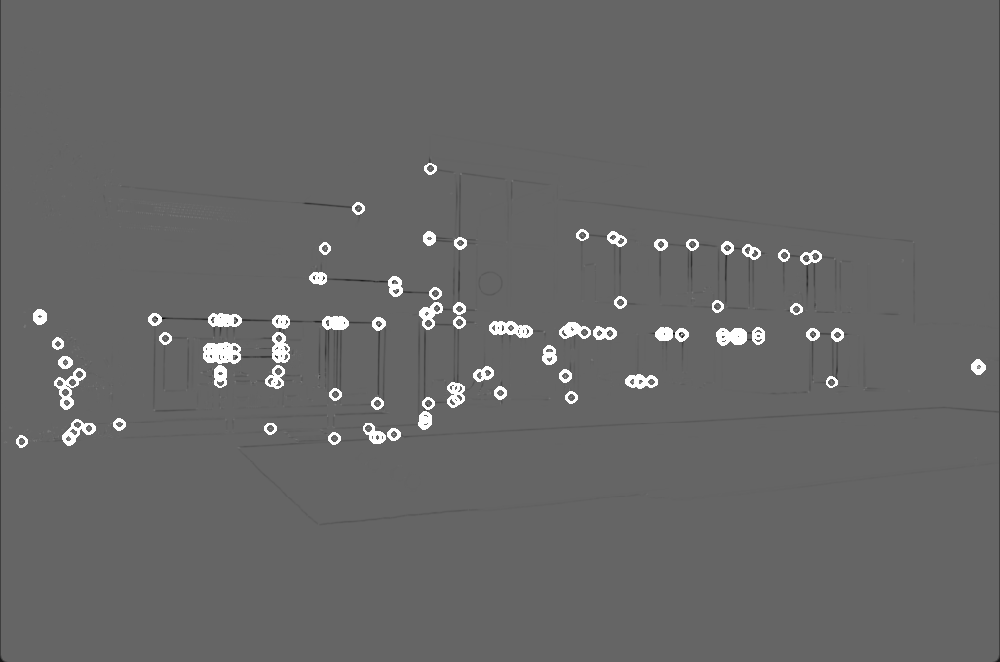

# harris corner detector
 A Basic OpenCV Implementation of the Harris Corner Detector

### Sample
Here, threshold was set to 120
Input | Output
--- | ---
 | 

---

## How it works: the code
### 1. Image Preprocessing
- The image is converted to grayscale using the OpenCV utility:
```cpp
    cvtColor( src, src_gray, COLOR_BGR2GRAY );
```
### 2. The ```detectCornerHarris``` function
- First, we create a matrix of zeros to store the output, and set other parameters such as block size (size of neighbourhood considered for corner detection), aperture (Aperture parameter of the Sobel derivative used) and k (Harris detector free parameter in the equation).
- Next we pass it to the OpenCV ```cornerHarris``` function
- Since the output pixel values from the corner detector are indeterminate and possibly negative, we normalize the values between 0 and 255 using the ```normalize()``` OpenCV function. 
- We then loop over every element in the normalized matrix, and check if the pixel value is above the threshold. If true, we draw a circle over it.

---
## How it works: the Harris Corner Detector
The basic principle of the Harris Detector is quite simple: 
- We take a small window in the image, and shift it by a tiny amount.
- Then we calculate the amount of shift between the two sets of pixels in the original and shifted windows. For this, we use the sum squared difference (SSD).
- The objective is to find pixels that maximize SSD.